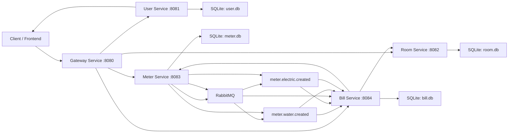
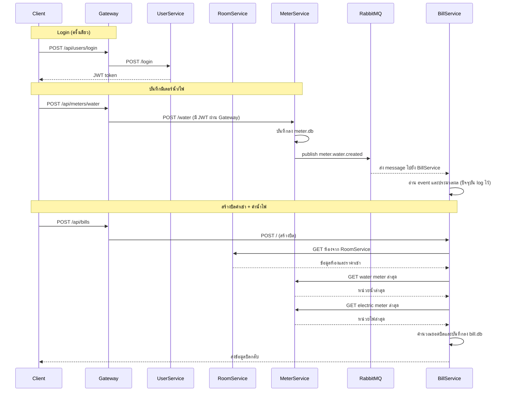
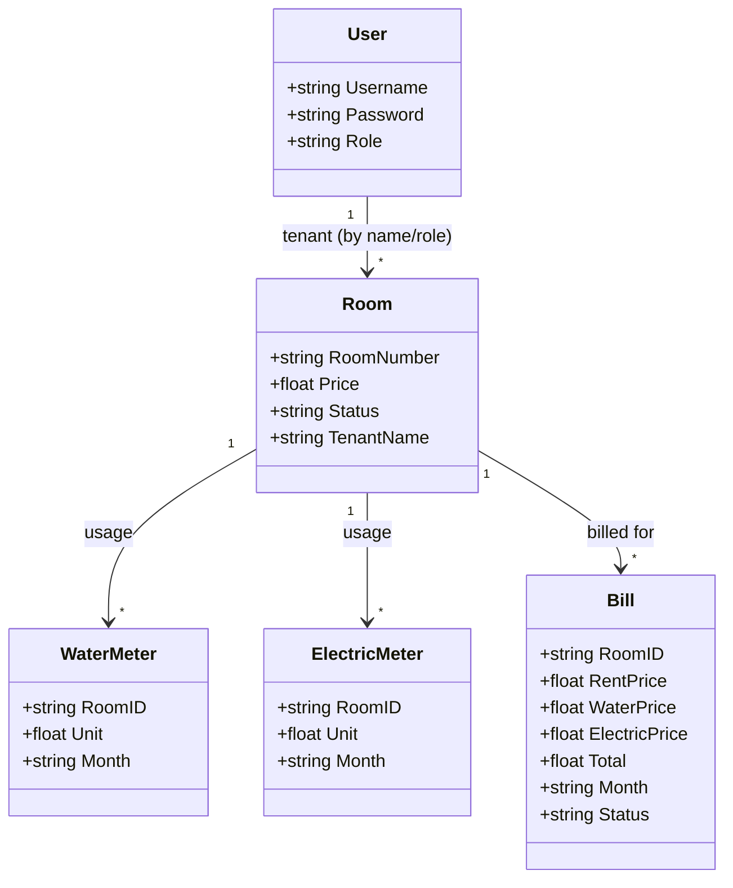

```mermaid
sequenceDiagram
    participant MS as MeterService
    participant RQ as RabbitMQ
    participant BS as BillService

    Note over MS,RQ: Startup MeterService
    MS->>RQ: connect (RABBITMQ_URL)
    MS->>RQ: declare queues\nmeter.water.created, meter.electric.created

    Note over BS,RQ: Startup BillService
    BS->>RQ: connect (RABBITMQ_URL)
    BS->>RQ: declare queues
    BS->>RQ: start consumers\nfor both queues

    Note over MS,RQ: When water meter is created
    MS->>RQ: publish message to meter.water.created
    RQ-->>BS: deliver message to consumer
    BS->>BS: handle event (ตอนนี้แค่ log)

    Note over MS,RQ: When electric meter is created
    MS->>RQ: publish message to meter.electric.created
    RQ-->>BS: deliver message to consumer
    BS->>BS: handle event (ตอนนี้แค่ log)