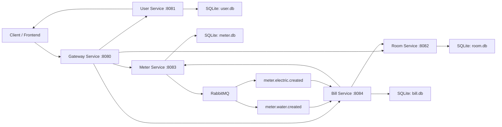

```mermaid
sequenceDiagram
    participant C as Client
    participant GW as Gateway
    participant US as UserService
    participant RS as RoomService
    participant MS as MeterService
    participant MQ as RabbitMQ
    participant BS as BillService

    Note over C,GW: Login (ครั้งเดียว)
    C->>GW: POST /api/users/login
    GW->>US: POST /login
    US-->>C: JWT token

    Note over C,MS: บันทึกมิเตอร์น้ำ/ไฟ
    C->>GW: POST /api/meters/water
    GW->>MS: POST /water (มี JWT ผ่าน Gateway)
    MS->>MS: บันทึกลง meter.db
    MS->>MQ: publish meter.water.created
    MQ-->>BS: ส่ง message ไปยัง BillService
    BS->>BS: อ่าน event และประมวลผล (ปัจจุบัน log ไว้)

    Note over C,BS: สร้างบิลค่าเช่า + ค่าน้ำไฟ
    C->>GW: POST /api/bills
    GW->>BS: POST / (สร้างบิล)
    BS->>RS: GET ห้องจาก RoomService
    RS-->>BS: ข้อมูลห้องและราคาเช่า
    BS->>MS: GET water meter ล่าสุด
    MS-->>BS: หน่วยน้ำล่าสุด
    BS->>MS: GET electric meter ล่าสุด
    MS-->>BS: หน่วยไฟล่าสุด
    BS->>BS: คำนวณยอดบิลและบันทึกลง bill.db
    BS-->>C: ส่งข้อมูลบิลกลับ